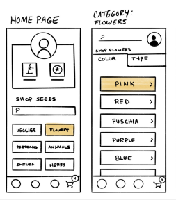
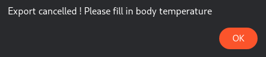

# Feature: Export Symptoms File

As a patient,  
I want to export my symptoms file,  
So that I can present it to a medical specialist during my visit

## UX Design & Wireframes

## Rule: The export can only be done if all symptoms have been checked.

#### Example: Export is blocked if body temperature not checked

- Given I am patient "Alexander"
- And I have filled my symptoms

| Symptom          | Value |
|------------------|------|
| Soar Throat      | No   |
| Body Temperature |      |

- When I try to export my symptoms file
- Then I receive an error message "Export cancelled ! Please fill in 'Body Temperature"  

#### Example: Export is blocked if personal health info missing

- Given I am patient "Samy"
- And I have the following personal health info

| Health Criteria | Value |
|-----------------|-------|
| Height          | 180cm |
| Sex             | male  |
| Smoker          |       |
- When I try to export my symptoms file
- Then I receive an error message "Export Cancelled ! Please fill in your health information"

## Rule: The export can be in different file formats

#### Examples: The export can be done in

| format                 | generated file |
|------------------------|----------------|
| portable document file | export.pdf     |
| microsoft excel        | export.xls     |

